# Heltec ESP32 LoRa v3

### The unofficial library

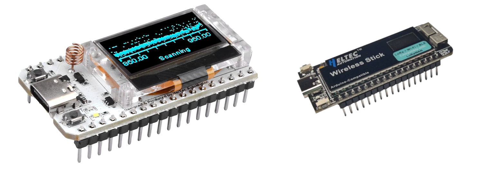

<p align="right"><kbd><b><a href="#quick-reference">Quick Reference</a></b></kbd></p>

## Introduction

There's this Chinese company named Heltec, and they make a cool little development board that has an Espressif ESP32S3 (which has WiFi and Bluetooth), a 128x64 pixel OLED display and an SX1262 863-928 MHz radio on it. It sells under different names on the internet, but internally they call it **[HTIT-WB32LA](images/heltec_esp32_lora_v3_documentation.pdf)**. (They have a 470-510 MHz version also, called HTIT-WB32LAF.) The hardware is cool, the software that comes with it is not so much my taste. There's multiple GitHub repositories, it's initailly unclear what is what, they use some radio stack of unknown origin, code-quality and documentation varies, some examples need tinkering and what could be a cool toy could easily become a very long weekend of frustration before things sort of work.

This library allows you to use that time to instead play with this cool board. The examples are tested, and this library assumes that for all things sub-GHz, you want to use the popular RadioLib.

*As for the name: if I had to name it today, this library would be called "Heltec Unofficial", which is the name of the include file. I named it after one of the names of the first of the currently supported boards. Library names are hard to change, so the name is what it is.*

&nbsp;

> [!NOTE]  
> Some larger changes have happened: among other things the library now depends on (which means it auto-installs) RadioLib and the display library. The name of the include file also changed from `heltec.h` to `heltec_unofficial.h` so that you can have it installed alongside the library made by heltec itself. Make sure you update existing code to reflect this change.

&nbsp;

<hr>

## The great Heltec board confusion

First of all let's be clear what hardware we are talking about here. There is some level of general confusion when it comes to Heltec devices. They make a bewildering array of stuff, and it's not always clear (to me at least) what they call certain pieces of hardware and what specs this hardware has. This library is made to work with the devices pictured below. Their names all end in "v3".

&nbsp;

<table>
<tr><td colspan="3" align="center">

**ESP32-S3** processor<br>
<sup>*( 2.4 GHz WiFi, BT 5 LE, 512 MB SRAM )*</sup><br>
**8 MB** SPI flash<br>
USB-C, **CP2102** USB serial chip<br>
Semtech **SX1262** sub-GHz transceiver<br>
3.7V LiPo battery charging circuit

</td>


<tr>

<td width="300px" align="center" valign="top">

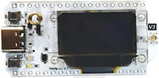

<td width="300px" align="center" valign="top">


<td width="300px" align="center" valign="top">

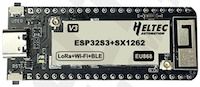

</td>
</tr><tr>

<td align="center" valign="top">

**WiFi LoRa 32(V3)** a.k.a.<br>
**HTIT-WB32LA** a.k.a.<br>
**ESP32 LoRa v3**

</td><td align="center" valign="top">

**Wireless Stick(V3)** a.k.a.<br>
**HTIT-WS_V3**

</td><td align="center" valign="top">


**Wireless Stick Lite(V3)**<br>
a.k.a. **HTIT-WSL_V3**

</td>

</tr>

<tr><td align="center" valign="top">

**128 x 64 OLED**

</td>
<td align="center" valign="top">

**64 x 32 OLED**

</td>
<td align="center" valign="top">

no display

</td></tr>

<tr><td align="center" valign="top">

No RF shielding

</td>
<td align="center" valign="top" colspan="2">

Metal shielding

</td>
</tr>

<tr><td align="center" valign="top" colspan="2">

Built-in Wifi antenna<br>
LoRa antenna connector IPEX1.0


</td>
<td align="center" valign="top">

Built-in Wifi antenna<br>
WiFi ant. conn. IPEX1.0 (right)<br>
LoRa ant. conn. IPEX1.0 (left)

</td>
</tr>

<tr><td align="center" valign="top"><b>147 µA</b> (button wakes)<br><b>24 µA</b> (clock wakes)</td><td align="center" valign="top"><b>141 µA</b> (button wakes)<br><b>24 µA</b> (clock wakes)</td><td align="center" valign="top"><b>130 µA</b> (button wakes)<br><b>17 µA</b> (clock wakes)</td></tr> 

</table>

&nbsp;

This library is unlikely to work as is with any other devices, whether made by Heltec or by others. You may be able to modify it, or use ideas or whole chunks of code from it, but just **know that this library is only known to work with the boards picture above**. For purposes of clarity, I might speak about "the regular board", "the stick" and "the stick lite" to mean the supported devices.

&nbsp;

<hr>

## Setting up

### 1. Install this library

Use the library manager to install this library. Find it by entering "heltec_esp32" in the library manager search box.

### 2. Add ESP32 URL to settings

```
https://espressif.github.io/arduino-esp32/package_esp32_index.json
```

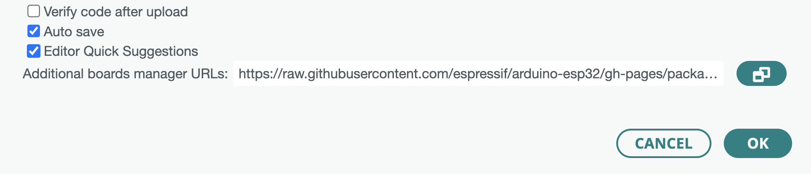

to the additional board manager URL to the Settings of the Arduino IDE. 

> *(Make sure this and any URLs that might be already there are sperated by commas. If you hit OK the IDE will then load the files needed.)*

### 3. Install ESP32

Go to board manager and install "esp32 by Espressif Systems". At the time of writing this, the latest version is 2.0.16.

### 4. Select the board

Start Arduino IDE and from the board dropdown select "Select another board and port" and enter "heltec" in the search box. Select the board named "Heltec WiFi LoRa 32(V3) / Wireless shell(V3)" as in the image below. Do not use any of the other boards, even if they look right.

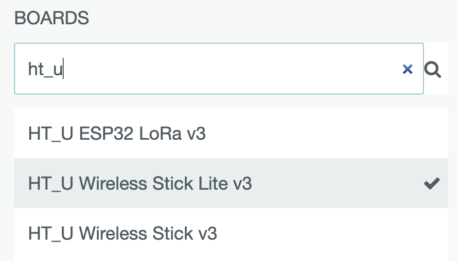

### 5. Stick or Stick Lite?

If your board is a Wireless Stick or Wireless Stick Lite, you **must** put `#define HELTEC_WIRELESS_STICK` or `#define HELTEC_WIRELESS_STICK_LITE` respectively in your code **before** `#include <heltec_unofficial.h>` or things will not work for you. 

> * _If you have the Stick Lite, the code needs to skip anything related to a display, in case of the Stick, the display dimensions need to be set differently and the "external" power is turned on by default, as it feeds the display._

> * _Main symptom of things not working on the stick is jerky and slow serial output while you are printing to `both` (see below) as the device waits for SPI timeouts from an OLED display that doesn't have power._

<hr>

## Getting started

To use this library, in your sketches, `#include <heltec_unofficial.h>`. This will provide the display, radio and button instances. Then in your `setup()`, put `heltec_setup()` to initialize the serial port at 115.200 bps and initialize the display. In the `loop()` part of your sketch, put `heltec_loop()`. This will make sure the button is scanned, and provides the [deep sleep "off"](#using-it-as-the-power-button) functionality if you set that up.

```cpp
#include <heltec_unofficial.h>

void setup() {
  heltec_setup();

  [...]
}

void loop() {
  heltec_loop();

  [...]
}
```

&nbsp;

> * _If you `#define HELTEC_NO_RADIO_INSTANCE` and/or `#define HELTEC_NO_DISPLAY_INSTANCE` before `#include <heltec_unofficial.h>`, you get no instances of `radio` and/or `display`, so you can set these up manually. Note that the library then also doesn't turn things off at sleep, etc._
> * _If you would prefer these libraries not even be included, use `#define NO_RADIOLIB` and `#define NO_DISPLAY` respectively._

&nbsp;

<hr>

## RadioLib

<kbd><b><a href="https://jgromes.github.io/RadioLib/">API documentation</a></b></kbd>

Next to the radio examples in this library, all [RadioLib examples](https://github.com/jgromes/RadioLib/tree/master/examples) that work with an SX1262 work here. Simply `#include <heltec_unofficial.h>` instead of RadioLib and remove any code that creates a `radio` instance, it already exists when you include this library.

> * _It might otherwise confuse you at some point: while Heltec wired the DIO1 line from the SX1262 to the ESP32 (as they should, it is the interrupt line), they labeled it in their `pins_arduino.h` (my board definitions have it as both) and much of their own software as DIO0. The SX1262 IO pins start at DIO1._
> * _If you place `#define HELTEC_NO_RADIOLIB` before `#include <heltec_unofficial.h>`, RadioLib will not be included and this library won't create a radio object. Handy if you are not using the radio and need the space in flash for something else or if you want to use another radio library or so._

&nbsp;

### Convenience macros

#### `RADIOLIB()` and `RADIOLIB_OR_HALT()`

This library provides convenience macros when calling RadioLib functions. It can be used for those functions that return a status code. When your code calls

```cpp
RADIOLIB_OR_HALT(radio.setFrequency(866.3));
```
this gets translated into

```cpp
  _radiolib_status = radio.setFrequency(866.3);
  Serial.print("[RadioLib] ");
  Serial.print("radio.setFrequency(866.3)");
  Serial.print(" returned ");
  Serial.print(_radiolib_status);
  Serial.print(" (");
  Serial.print(radiolib_result_string(_radiolib_status));
  Serial.println(")");
  if (_radiolib_status != RADIOLIB_ERR_NONE) {
    Serial.println("[RadioLib] Halted");
    while (true) {
        heltec_loop();
    }
  }
```

In other words, this saves a whole lot of typing if what you want is for RadioLib functions to be called and serial debug output to be generated. Calling `RADIOLIB` instead of `RADIOLIB_OR_HALT` does the same thing without the halting. 

> * _The `heltec_loop()` part in `RADIOLIB_OR_HALT` makes sure that if you have set the `PRG` button to be the power button, it still works when execution is halted._
> * _`_radiolib_status` is an integer that the library provides and that your code can check afterwards to see what happened._
> * _`radiolib_result_string()` returns a textual representation (e.g. `CHIP_NOT_FOUND`) for a few of the most common errors or a URL to look up the others._

&nbsp;

### LoRaWAN

Using these Heltec chips, you can experiment with LoRaWAN networks such as [The Things Network](https://www.thethingsnetwork.org/). If you create an account there and have a gateway somewhere nearby, you can send small binary messages that will show up at the designated server on the internet. You can make an account and use their servers to see your messages appear.

Because of the limited throughput (a few small messages every once in a while) LoRaWAN is really most suitable for sensors, meter readings and things like that. To use it with the Heltec boards, you'd probably want to make the device go to deep sleep between readings, so the battery would last a nice long time.

To speak LoRaWAN, you need to store some provisioning information such as identifiers and cryptographic keys. In addition to that, the RadioLib LoRaWAN code needs the user to hang on to some session state during long sleep to resume the same session. I wrote another library, called **[LoRaWAN_ESP32](https://github.com/ropg/LoRaWAN_ESP32)** to manage both the provisioning data and the session state in flash. Please refer to that library's README for more details.

If you install the LoRaWAN_ESP32 library, you can compile the example called [LoRaWAN_TTN](/examples/LoRaWAN_TTN/LoRaWAN_TTN.ino) that comes with this library to see it in action. (That example is nearly identical to the example that comes with LaRaWAN_ESP32, just set up to have this library provide the radio instance.)

<hr>

## Display

<kbd><b><a href="https://github.com/ThingPulse/esp8266-oled-ssd1306#api">API documentation</a></b></kbd>

The tiny OLED display uses the same library that the original library from Heltec uses, except now the examples work so you don't have to figure out how to make things work.

`heltec_display_power(bool on)` can be used with `true` or `false` to turn the display on and off. `hetlec_setup()` turns it on.

There's the primary display library and there's an additinal UI library that allows for multiple frames. The display examples will show you how things work. The library, courtesy of ThingPulse, is well-written and well-documented. [Check them out](https://thingpulse.com/) and buy their stuff.

> *This library used to include a fork of that library that had improved `print` functionality, but all my changes have been upstreamed, so we're back to depending on the original.*

&nbsp;

### Printing to both Serial and display: `both.print()`

Instead of using `print`, `println` or `printf` on either `Serial` or `display`, you can also print to `both`. As the name implies, this prints the same thing on both devices. You'll find it used in many of this library's examples.

&nbsp;

<hr>

## Button

<kbd><b><a href="https://github.com/ropg/HotButton">API documentation</a></b></kbd>

The user button marked 'PRG' on the regular board and 'USER' on the stick is handled by my own HotButton library that is automatically installed when you install this one. Since we have only one button it makes sense to be able to do as many different things with it as possible. It provides the generic `button.isSingleClick()` and `button.isDoubleClick()`, but it can do much more than that. I recommed having a quick look at its (short) [documentation](https://github.com/ropg/HotButton) to see what it can do.

Remember to put `heltec.loop()` in the`loop()` of your sketch to make sure your button gets updated so you can use these functions.

&nbsp;

### Using it as the power button

If you hook up this board to power, and especially if you hook up a LiPo battery (see below), you'll notice there's no on/off switch. Luckily the ESP32 comes with a very low-power "deep sleep" mode where it draws so little current it can essentially be considered off. Since signals on GPIO pins can wake it back up, we can use the button on the board as a power switch. In your sketch, simply put **`#define HELTEC_POWER_BUTTON`** before `#include <heltec_unofficial.h>`, make sure `heltec_loop()` is in your own `loop()` and then a button press will wake it up and a long press will turn it off. You can still use `button.isSingleClick()` and `button.isDoubleClick()` in your `loop()` function when you use it as a power button.

> * _If you use `delay()` in your code, the power off function will not work during that delay. To fix that, simply use **`heltec_delay()`** instead._

&nbsp;

<hr>

## Deep Sleep

You can use `heltec_deep_sleep(<seconds>)` to put the board into this 'off' deep sleep state yourself. This will put the board in deep sleep for the specified number of seconds. After it wakes up, it will run your sketch from the start again. You can use `heltec_wakeup_was_button()` and `heltec_wakeup_was_timer()` to find out whether the wakeup was caused by the power button or because your specified time has elapsed. You can even hold on to some data in variables that survive deep sleep by tagging them `RTC_DATA_ATTR`. More is in [this tutorial](https://randomnerdtutorials.com/esp32-deep-sleep-arduino-ide-wake-up-sources/).

In deep sleep, with this library, according my multimeter power consumption drops to **147 µA** on the regular board (**141 µA** on the stick) if you have defined `HELTEC_POWER_BUTTON`, or **24 µA** on either board if you only use the timer to wake up. Please let me know if you can get it lower than that.

> * _If you call `heltec_deep_sleep()` without a number in seconds when not using the power button feature, you will need to reset it to turn it back on. Note that resetting does reinitialize any `RTC_DATA_ATTR` variables._
> * _The`deep_sleep_tester` example lets you easily put it in the four essential deep sleep modes: no wakeup other than reset, clock-wakeup, button-wakeup or both. I may be doing somthing wrong, but I don't measure any difference between having clock wakeup enabled and having no wakeup sources._

&nbsp;

<hr>

## LED

The board has a bright white LED, next to the orange power/charge LED. This library provides a function `heltec_led()` that takes the LED brightness in percent. It's really bight, you'll probably find 50% brightness is plenty.

&nbsp;

<hr>

## Battery

The board is capable of charging a LiPo battery connected to the little 2-pin connector at the bottom. `heltec_vbat()` gives you a float with the battery voltage, `heltec_battery_percent()` provides the estimated percentage full.

Note that it takes a single cell (3.7 V) LiPo and that the plus is on the left side when holding the board with the USB-C connector facing up.

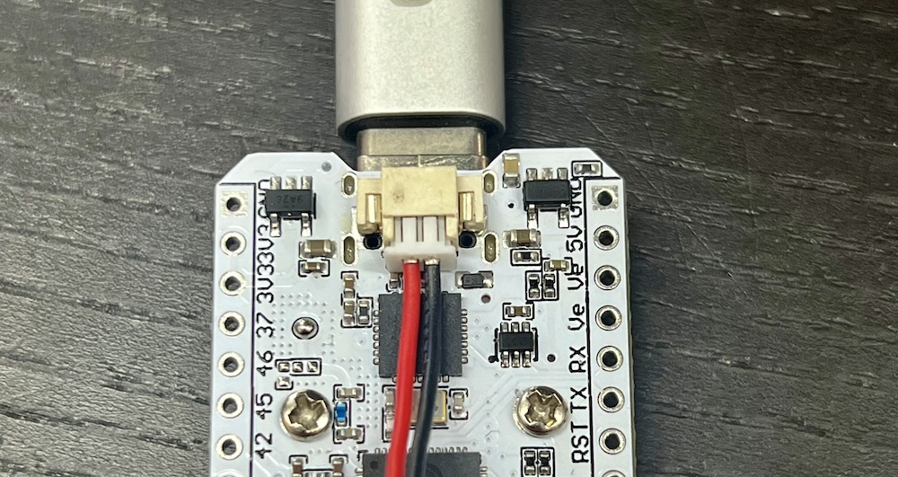

> * _According to the [schematic](images/heltec_esp32_lora_v3_schematic.pdf), the charge current is set to 500 mA. There's a voltage measuring setup where if GPIO37 is pulled low, the battery voltage appears on GPIO1. (Resistor-divided: VBAT - 390kΩ - GPIO1 - 100kΩ - GND)_
> * _You can optionally provide the float that `heltec_vbat()` returns to `heltec_battery_percent()` to make sure both are based on the same measurement._
> * _The [charging IC](images/tp4054.pdf) used will charge the battery to ~4.2V, then hold the voltage there until charge current is 1/10 the set current (i.e. 50 mA) and then stop and let it discharge to 4.05V (about 90%) and then charge it again, so this is expected._
> * _The orange charging LED, on but very dim if no battery is plugged in, is awfully bright when charging, and the IC on the reverse side of the reset switch gets quite hot when the battery is charging but still fairly empty. It's limited to 100 ℃ so nothing too bad can happen, just so you know._

The battery percentage estimate in this library is based on a real LiPo discharge curve.


The library contains all the tools to measure your own curve and use it instead, see [`heltec_unofficial.h`](src/heltec_unofficial.h) for details.

&nbsp;

<hr>

## Ve - external power

There's two pins marked 'Ve' that are wired together and connected to a GPIO-controlled FET that can source 350 mA at 3.3V to power sensors etc. Turn on by calling `heltec_ve(true)`, `heltec_ve(false)` turns it off.

On the stick, this is also what powers the OLED display. This libary turns it on when initializing when you have set `#define HELTEC_WIRELESS_STICK` before `#include <heltec_unofficial.h>`

> _(Not that they told anyone they hooked the display to "external power", so that's one afternoon I will never get back.)_

&nbsp;

<hr>

## Built-in temperature sensor

```cpp
float temp = heltec_temperature();
```

The ESP32 has an internal temperature sensor.  Our measurement function picks the most accurate out of 5 possible ranges. Accuracy is listed by Espressif as follows:

| from  | to  | max. err. |
| ----:| ---:|:----------:|
-40°C | -30°C | < 3°C
-30°C | -10°C | < 2°C
-10°C | 80°C  | < 1°C
80°C  | 100°C | < 2°C
100°C | 125°C | < 3°C

In scenarios where there's a lot of deep sleep, if you make sure you get your measurement right after boot it might even reflect ambient temperature.

&nbsp;

<hr>

&nbsp;

## Minimal example to show everything:

```cpp
// Turns the 'PRG' button into the power button, long press is off 
#define HELTEC_POWER_BUTTON   // must be before "#include <heltec_unofficial.h>"

// Uncomment this if you have Wireless Stick v3
// #define HELTEC_WIRELESS_STICK

// creates 'radio', 'display' and 'button' instances 
#include <heltec_unofficial.h>

void setup() {
  heltec_setup();
  Serial.println("Serial works");
  // Display
  display.println("Display works");
  // Radio
  display.print("Radio ");
  int state = radio.begin();
  if (state == RADIOLIB_ERR_NONE) {
    display.println("works");
  } else {
    display.printf("fail, code: %i\n", state);
  }
  // Battery
  float vbat = heltec_vbat();
  display.printf("Vbat: %.2fV (%d%%)\n", vbat, heltec_battery_percent(vbat));
}

void loop() {
  heltec_loop();
  // Button
  if (button.isSingleClick()) {
    display.println("Button works");
    // LED
    for (int n = 0; n <= 100; n++) { heltec_led(n); delay(5); }
    for (int n = 100; n >= 0; n--) { heltec_led(n); delay(5); }
    display.println("LED works");
  }
}
```

For a more meaningful demo, especially if you have two of these boards, [check out `LoRa_rx_tx`](examples/display_and_radio/LoRa_rx_tx/LoRa_rx_tx.ino) in the examples. The [`LoRaWAN_TTN` example](examples/display_and_radio/LoRaWAN_TTN/LoRaWAN_TTN.ino) works, uses [The Things Network](https://www.thethingsnetwork.org/) and goes to deep sleep between sends.

&nbsp;

<hr>

## Quick Reference

Here's a list of everything previous. Everything is clickable for more information. Remember these defines only work if they occur before `#include <heltec_unofficial.h>`

<table>
<tr><th align="left"> 

`#define`
</th><th align="left">

functions
</th><th align="left">

instances
</th></tr>

</tr><tr><td valign = "top">

[`HELTEC_NO_DISPLAY`](#getting-started)

[`HELTEC_NO_DISPLAY_INSTANCE`](#getting-started)

[`HELTEC_NO_RADIOLIB`](#getting-started)

[`HELTEC_NO_RADIO_INSTANCE`](#getting-started)

[`HELTEC_POWER_BUTTON`](#using-it-as-the-power-button)

[`HELTEC_WIRELESS_STICK`](#not-using-my-board-definitions-define-heltec_wireless_stick)

</td><td valign = "top">

[`int heltec_battery_percent(float vbat = -1)`](#battery)

[`void heltec_deep_sleep(int seconds = 0)`](#deep-sleep)

[`void heltec_delay(int ms)`](#using-it-as-the-power-button)

[`void heltec_display_power(bool on)`](#display)

[`void heltec_led(int percent)`](#led)

[`void heltec_loop()`](#getting-started)

[`void heltec_setup()`](#getting-started)

[`float heltec_temperature()`](#built-in-temperature-sensor)

[`float heltec_vbat()`](#battery)

[`void heltec_ve(bool state)`](#ve---external-power)

[`bool heltec_wakeup_was_button()`](#deep-sleep)

[`bool heltec_wakeup_was_timer()`](#deep-sleep)

</td><td valign = "top">

[`button`](https://github.com/ropg/HotButton)

[`display`](https://github.com/ThingPulse/esp8266-oled-ssd1306#api)

[`radio`](https://jgromes.github.io/RadioLib/)

</td></tr></table>

&nbsp;


### Heltec ESP32 LoRa v3 / HTIT-WB32LA / "the regular board"

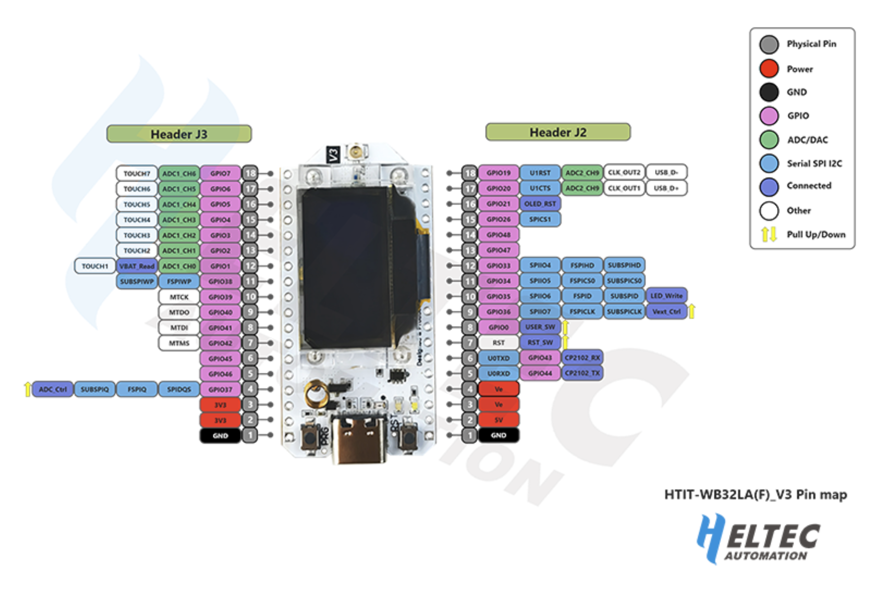

[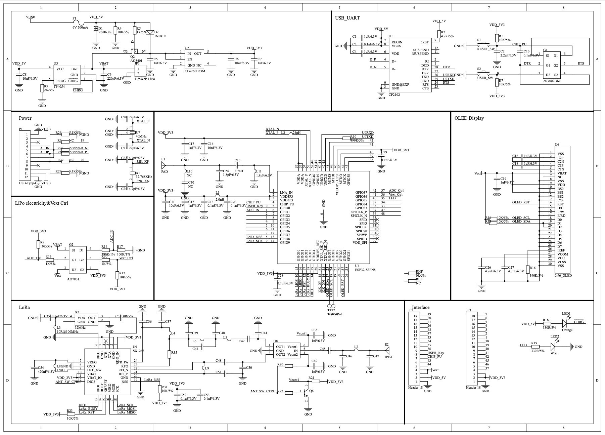](https://github.com/ropg/heltec_esp32_lora_v3/blob/main/images/heltec_esp32_lora_v3_schematic.pdf)

&nbsp;

### Heltec Wireless Stick v3 / HTIT-WS_v3 / "the stick"

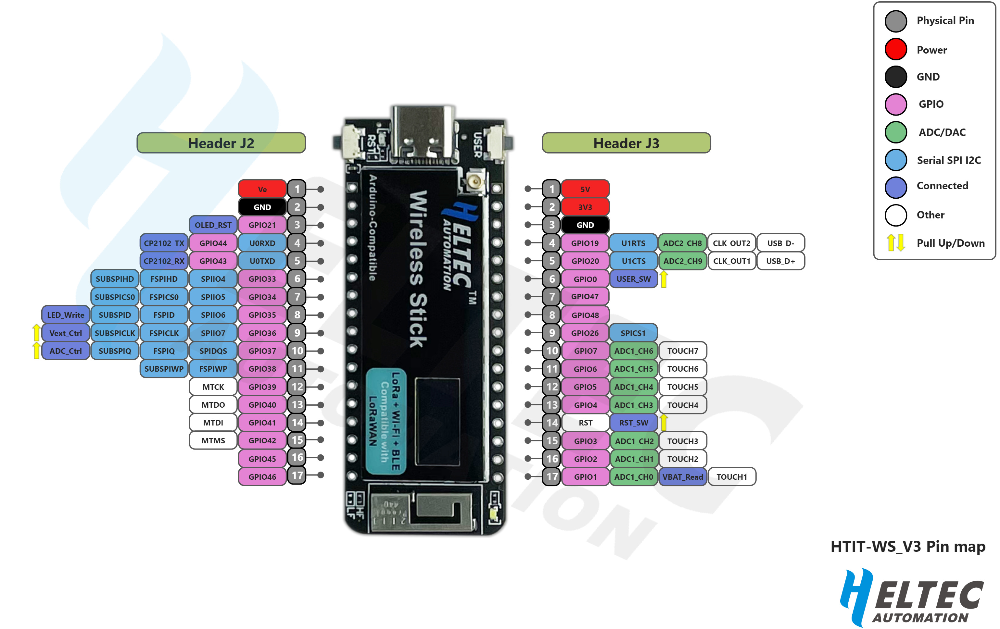

[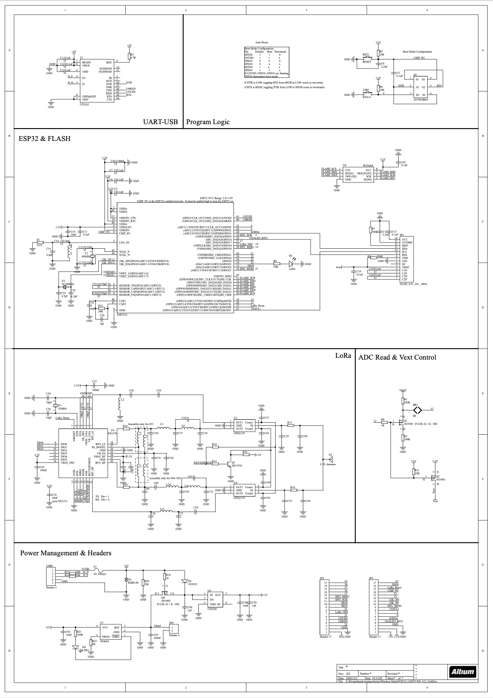](images/Heltec_Wireless_Stick_v3_schematic.pdf)

&nbsp;

### Heltec Wireless Stick Lite v3 / HTIT-WSL_v3 / "the stick lite"


[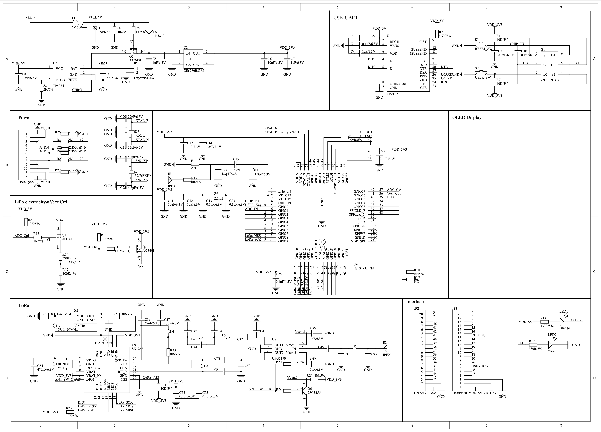](https://github.com/ropg/heltec_esp32_lora_v3/blob/main/images/Heltec_Wireless_Stick_Lite_v3_schematic.pdf)

&nbsp;

***If you read this far, would you please star this repository?***  <br>
*(Not so much for my ego, but it helps other people find it. Thanks!)*
