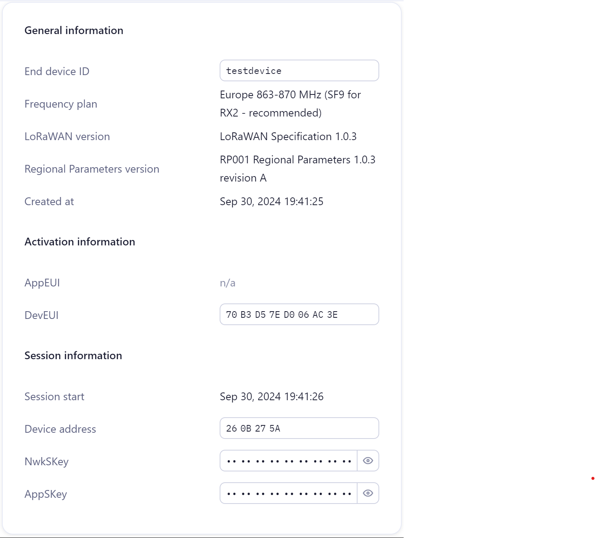

# Heltec ESP32 LoRa V3 LoRaWAN Example

This project demonstrates sending a two-byte LoRaWAN message using the Heltec ESP32 LoRa V3 module. The message is transmitted every 15 minutes, containing a counter and the ESP32 chip temperature (in °C + 100).

## Requirements

- Heltec ESP32 LoRa V3 module
- Arduino IDE
- [LoRaWAN_ESP32](https://github.com/ropg/LoRaWAN_ESP32) library
- [heltec_unofficial](https://github.com/decodeais/heltec_unofficial) library

## Features

- If The Things Network (TTN) or LoRaWAN provisioning information is not stored, the user will be prompted via serial to enter it the first time. Then it is stored in the flash. when you want to change the data erase with "complete" option.
- Sends a two-byte LoRaWAN message every 15 minutes.
  - The first byte is an 8-bit counter.
  - The second byte is the ESP32 chip temperature (in Celsius, offset by +100).

- Manages duty cycle compliance with TTN's Fair Use Policy.

## How It Works

1. The Heltec ESP32 LoRa V3 module wakes up from deep sleep every 15 minutes.
2. Upon waking up, the chip temperature is read and printed to the serial monitor.
3. The LoRa radio is initialized and connected to the network.
4. A two-byte message is sent:
    - First byte: Incrementing counter.
    - Second byte: ESP32 chip temperature + 100.
5. If downlink data is received, it is stored for processing.
6. The system then enters deep sleep and repeats the process.

## Installation

1. Install the Arduino IDE if you haven't already.
2. Install the `LoRaWAN_ESP32` library through the Arduino Library Manager.
3. Clone this repository and open the project in Arduino IDE.
4. Select the correct board (Heltec ESP32 LoRa V3) under `Tools > Board`.

## Usage

1. If have free account at the things network ( https://eu1.cloud.thethings.network/ )
you can generate your credentials:

1. Flash the code to your Heltec ESP32 LoRa V3 module.

3. On first boot, enter TTN/LoRaWAN credentials via the serial monitor.

4. The device will then send a message every 15 minutes with the counter and temperature data.

5. Monitor the serial port for feedback and temperature readings.

## License

This project is licensed under the MIT License. See the [LICENSE](LICENSE) file for details.

