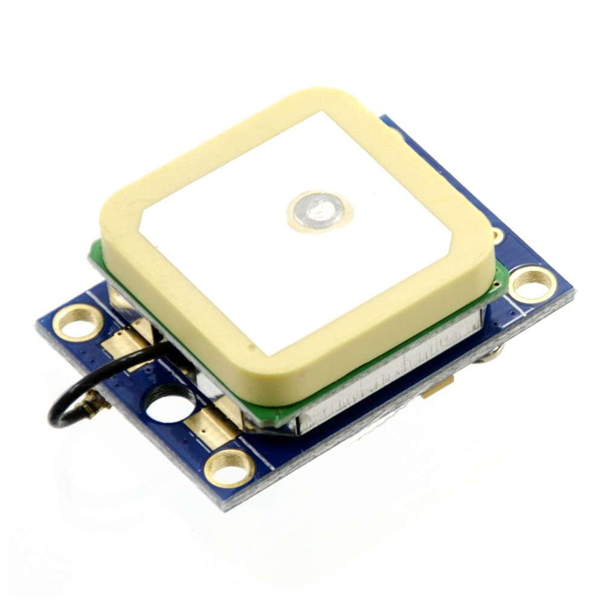

# GPS Data Logger with TinyGPS++

This Arduino project reads GPS data using the **TinyGPS++** library and displays the information on both the serial monitor and an OLED display. The program retrieves various details like latitude, longitude, date, time, speed, altitude, and more.

## Features

Shows at the Serial Monitor:

| GPS Function         | Description                                          |
|----------------------|------------------------------------------------------|
| location.lat()       | Latitude in degrees (double)                         |
| location.lng()       | Longitude in degrees (double)                        |
| date.year()          | Year (2000+) (u16)                                   |
| date.month()         | Month (1-12) (u8)                                    |
| date.day()           | Day (1-31) (u8)                                      |
| time.hour()          | Hour (0-23) (u8)                                     |
| time.minute()        | Minute (0-59) (u8)                                   |
| time.second()        | Second (0-59) (u8)                                   |
| time.centisecond()   | 100ths of a second (0-99) (u8)                       |
| speed.knots()        | Speed in knots (double)                              |
| speed.mph()          | Speed in miles per hour (double)                     |
| speed.mps()          | Speed in meters per second (double)                  |
| speed.kmph()         | Speed in kilometers per hour (double)                |
| course.deg()         | Course in degrees (double)                           |
| altitude.value()     | Raw altitude in centimeters (i32)                    |
| altitude.meters()    | Altitude in meters (double)                          |
| altitude.miles()     | Altitude in miles (double)                           |
| altitude.kilometers()| Altitude in kilometers (double)                      |
| altitude.feet()      | Altitude in feet (double)                            |
| satellites.value()   | Number of satellites in use (u32)                    |
| hdop.value()         | Horizontal Dilution of Precision (HDOP) (100ths-i32) |

At the OLED it displays these values:

- **GPS Coordinates**: Displays latitude and longitude in degrees.
- **Date and Time**: Shows the current date (day, month, year) and time (hours, minutes, seconds, hundredths).
- **Speed**: Outputs the speed in kilometers per hour, knots, miles per hour, and meters per second.
- **Altitude**: Displays altitude in meters, miles, kilometers, and feet.
- **Course**: Displays the course in degrees.

## Hardware Requirements

- **Heltec ESP32 LoRa V3 Module** (or any ESP32 with serial communication)
- **GPS Module** (with TX/RX pins)
for example uBlox NEO-6

## Software Requirements

- **Arduino IDE**
- **TinyGPS++ Library**

### Installing TinyGPS++

To install the TinyGPS++ library:

1. Open Arduino IDE.
2. Go to **Sketch** > **Include Library** > **Manage Libraries**.
3. Search for `TinyGPS++` and click **Install**.

## Wiring

Connect the GPS module to the Heltec ESP32 as follows:

| GPS Module Pin | ESP32 Pin |
|----------------|-----------|
| TX             | GPIO 34   |
| RX             | GPIO 33   |
| VCC            | 3.3V      |
| GND            | GND       |

## Usage

1. Open the Arduino IDE and upload the code to your ESP32.
2. Open the serial monitor (baud rate: 115200).
3. Observe the GPS data being displayed every second on both the serial monitor and the OLED display.

## License

This project is open-source and available under the MIT License. See the `LICENSE` file for more details.

## Credits

- Developed by ChatGpt and Decodeais
- Built with the help of the [TinyGPS++](https://github.com/mikalhart/TinyGPSPlus) library.
